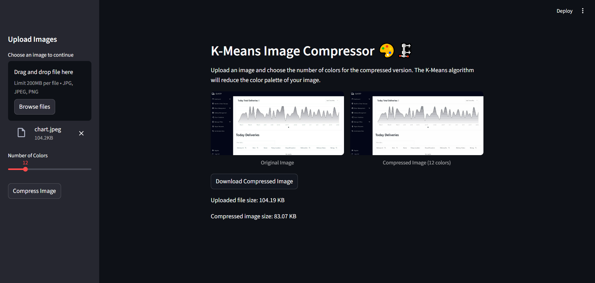

# Kmeans Image compressor 🎨🗜️
Simple app that utilizes Kmeans clustering algorithm to compress images.

The notebook at Notebook/K-means.ipynb contains both a from-scratch implementation and a scikit-learn based implementation of the KMeans algorithm to help understand how it works.

## Getting Started
1. Clone the repository:
```bash
    git clone https://github.com/your-username/kmeans-image-compressor.git
    cd kmeans-image-compressor
```
2. Create a virtual environment
```bash
    python -m venv venv
    source venv/bin/activate  
```

3. Install dependencies
```bash
    pip install -r requirements.txt
```
4. Run the app
```bash
    streamlit run main.py
```

## Screenshots
<p align="left">
  
</p>